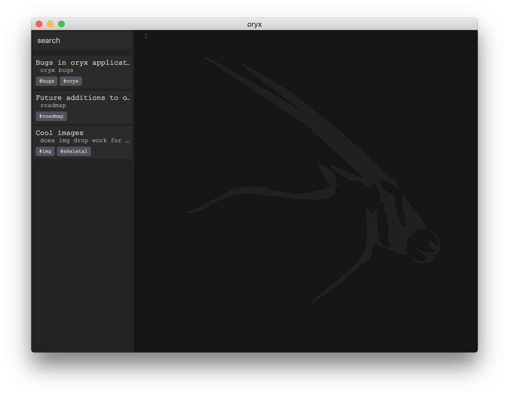
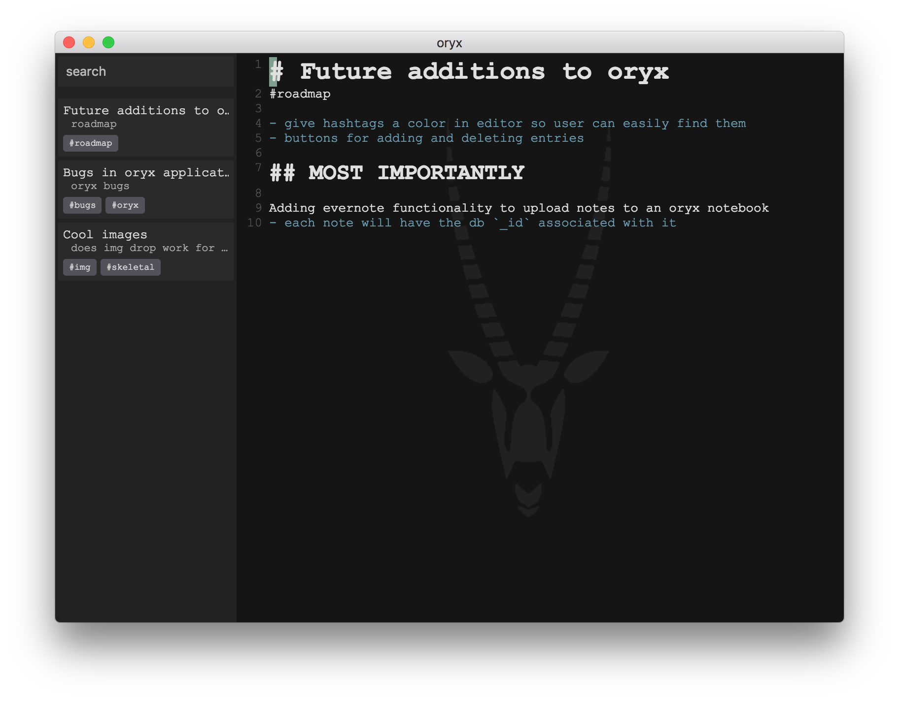
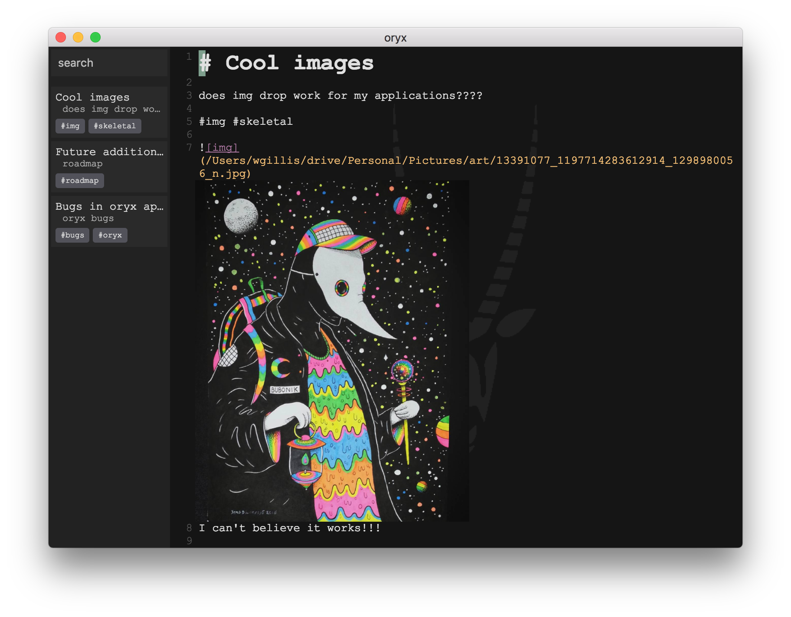

# Oryx

An app based on Bear app that uses markdown for editing and organizes notes by
tags and sub-tags. It uses electron to host the app.

It uses vim keybindings and a markdown theme to give realtime style to
your documents.

It also supports drag-and-drop for images to view within the document

A useful feature that this app will supply is a synchronization to evernote.
Compiled markdown will be sent to evernote with the proper tags to serve as
your viewable archive.

## Note:

I changed the cursor to a different color
